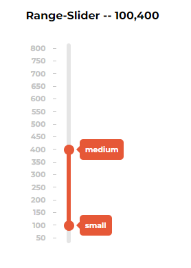
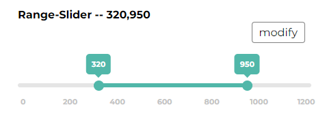

# Range-slider-plugin 

*... makes choosing smoothing*


&nbsp;&nbsp;&nbsp;&nbsp;


#### Table of contents

- [Description](#description)
- [Features](#features)
- [References](#references)
- [Build details](#build-details)
- [Commands](#commands)
- [Use](#use)
- [Options](#options)
- [Methods](#methods)
- [Project structure](#structure-details)
------------------


## Description

&emsp;The Range Slider Plugin is a flexible and highly customizable slider  component for web applications. It allows users to select a range of values or a single value within a specified range.
&emsp; The project is written in typescript for JQuery and uses an MVP pattern with passive view.(see [diagram](#structure-details))

&#10;
&#10;

## Features


- **Range Selection:** Users can select a range of values by dragging the slider thumbs.
- **Customization:** The plugin is highly customizable, allowing you to adjust the appearance and behavior to fit your needs.
  
- **Tooltip Support:** You can enable tooltips, and tooltip form to display the selected values.
- **Tick Marks:** Add tick marks to indicate specific values along the slider. The Ruler is adjustible to max and min values with an option to set the actual tick step.
- **Orientation:** Choose between horizontal and vertical orientations.

- **Reversed order:** On demand a reversed order option is available.
- **String values** Set your own string representation of values. The option also sets the actual data-value as string.
  

## References


- **[Watch Range-Slider Demo Page on GitHub Pages][gh-pages]**
- **[Skomarohov Arthur - GitHub source code][repo]**

&#13;
&#13;

## Build details

**Node version:** `v18.12.1`

**Webpack version:** `^5.75.0`


**Development dependencies:**

```
"@babel/plugin-transform-typescript": "^7.22.5",
"@babel/preset-env": "^7.22.5",
"@babel/preset-typescript": "^7.21.5",
"@types/chai": "^4.3.5",
"@types/jquery": "^3.5.16",
"@types/jsdom": "^21.1.1",
"@types/lodash": "^4.14.198",
"@types/mocha": "^10.0.1",
"@types/sinon": "^10.0.20",
"@typescript-eslint/eslint-plugin": "^5.59.11",
"babel-loader": "^9.1.2",
"chai": "^4.3.7",
"clean-webpack-plugin": "^4.0.0",
"copy-webpack-plugin": "^11.0.0",
"cross-env": "^7.0.3",
"css-loader": "^6.8.1",
"cz-conventional-changelog": "^3.3.0",
"eslint": "^8.43.0",
"eslint-config-standard-with-typescript": "^35.0.0",
"eslint-plugin-import": "^2.26.0",
"eslint-plugin-n": "^15.7.0",
"eslint-plugin-promise": "^6.1.1",
"gh-pages": "^6.0.0",
"html-loader": "^4.2.0",
"html-webpack-plugin": "^5.5.3",
"jquery": "^3.7.0",
"jsdom": "^22.1.0",
"mini-css-extract-plugin": "^2.7.6",
"mocha": "^10.2.0",
"postcss": "^8.4.24",
"postcss-loader": "^7.3.3",
"postcss-preset-env": "^8.5.0",
"sass": "^1.63.4",
"sass-loader": "^13.3.2",
"style-loader": "^3.3.3",
"ts-loader": "^9.4.3",
"ts-node": "^10.9.1",
"tsconfig-paths": "^4.2.0",
"typescript": "^5.1.3",
"webpack": "^5.87.0",
"webpack-cli": "^5.1.4",
"webpack-dev-server": "^4.15.1"
```

## Commands

**Installation**
```
npm install
 ```
**Server start:**
```
npm run start
```
**Project build:**
```
npm run build
```
**Publish:**
```
npm run deploy
```

**Test:**
```
npm run test
```
&#13;
&#13;


## Use  !!!! NOT FINISHED)

On downloading the source files import the plugin jquery wrapper

```
import "plugin-wrapper/plugin-wrapper";  (!!!! NOT FINISHED)
```
```JavaScript
$(".container-1").rangeSlider({
      max: 800,
      value: [100, 250],
      min: 50,
      step: 20,
      doublePoint: true,
      stringValues: ["small", "medium", "large", "giant"],
      orientation: "vertical",
      reversedOrder: true
    });


$(".container-2").rangeSlider({
      max: 1200,
      value: [320, 950],
      tickStep: 200,
      doublePoint: true,
      thumbSize: 15,
      trackHeight: 6,
      tooltipColor: "#51B7A9FF",
      fillColor: "#51B7A9FF",
      thumbColor: "#51B7A9FF",
      tickBar: false
    });    
```



## Options 


### **value** ```number | number[]``` 

Setting value makes plugin to initiate with the predefined value

```JS 
value: 200
```

In case of range values, when user wants to choose between start and end values, an array of values should be provided

```JS
value: 455
value: [100,450]
```
Making range values also requires to set a **doublePoint** option to ```true```
&#13;
&#13;

### **stringValues** ```string[]``` 

Setting the string representation of number values. Also, string values are set as the thumb's data-value. It's up to you to choose the strings and the array length - the array is associated regarding to the min and max values and splits the range accordingly.

```JS

stringValues: ["Gendalf", "Cat", "Fairy", "Awesome", "biggest"]
```


&#13;
&#13;

### **doublePoint** ```boolean``` 

Sets the double-thumb rendering so as to provide setting double values

```JS
doublePoint: true
```
&#13;
&#13;

### **orientation** ```"horizontal" | "vertical"```

The orientation option sets the vertical or horizontal position of the plugin

```JS
orientation: "horizontal"
```
&#13;
&#13;

### **trackHeight** ```number```
default: ```6```
The track height option sets the track height in pixels. In the case of a vertical orientation height means the thickness of the track.

```JS 
trackHeight: 10
```
&#13;
&#13;

### **trackColor** ```string```
default: ```lightgray```

Sets the track color.

```JS
trackColor: "transparent"
```
&#13;
&#13;


### **trackBorder** ```boolean```

The styling option sets the border of the track.
By default, the track border is set to ```false```

```JS
trackBorder: true
```
&#13;
&#13;

### **trackBorderColor** ```string```

The border styling option admits any color string

```JS
trackBorderColor: "rgba(255, 255, 255)"
trackBorderColor: "black"
trackBorderColor: "lightgray"
trackBorderColor: "#004242FF"
```
&#13;
&#13;

### **max**  ```number```

Sets the maximum possible value

```JS 
max: 1000
```
&#13;
&#13;

### **min**  ```number```

Sets the minimum possible value

```JS 
min: 50
```
&#13;
&#13;

### **thumbSize** ```number```

Sets the thumb size in pixels

```JS 
thumbSize: 15
```
&#13;
&#13;

### **thumbColor** ```string```

Sets the thumb color

```JS 
thumbColor: "red"
thumbColor: "linear-gradient(180deg, #6FCF97 0%, #66D2EA 100%)"
```
&#13;
&#13;

### **thumbShadow** ```boolean```

Sets the thumb shadow-glow around, switching on when hovering or dragging
default: ```true```

```JS 
thumbShadow: true
```
&#13;
&#13;


### **thumbShadowColor** ```string```

Sets the thumb shadow-glow color
by default the color is the same as thumb color
```JS 
thumbShadowColor: "green"
```
&#13;
&#13;

### **thumbBorder** ```boolean```

Sets the possibility ty style a thumb border 
default: ```false```

```JS 
thumbBorder: "true"
```
&#13;
&#13;

### **thumbBorderStyle** ```string```

Sets the style of a border. Option admits css style enumaration.

```JS 
thumbBorderStyle: "1px solid black"
```
&#13;
&#13;

### **thumbAnimation** ```boolean```

Sets the animation of thumb (slide on track click)
default: ```true```

```JS 
thumbAnimation: false
```
&#13;
&#13;

### **ticks** ```boolean```

Sets the ruler with ticks under the track (horizontal) or to the left of the track (vertical)
default: ```true```

```JS
ticks: true
```

&#13;
&#13;

### **tickBar** ```boolean```

Sets the small tick lines to make the ruler partition more evident.
default: ```true```

```JS
tickBar: false
```
&#13;
&#13;

### **rulerColor** ```string```

Sets the ruler ticks color

```JS
rulerColor: "black"
```
&#13;
&#13;

### **tickStep** ```number```

Adjusts the step of the ticks on the ruler
By default, ticks are calculated regarding the min and max values

```JS
tickStep: 100
```

&#13;
&#13;

### **tickFontSize** ```number```
default: ```11```

Sets the ruler tick-number font-size.

```JS
tickFontSize: 16
```

&#13;
&#13;

### **step** ```number```
default: ```1```
Sets the minimal distance a thumb is able to move while dragging or on track click. If the min and max values are not compatible with the step, the closest distance to min or max values becomes the step value.

```JS
max: 100,
min: 0,
step: 10
```

&#13;
&#13;

### **tooltip** ```boolean```

Sets the tooltip of the thumb. Contains value changing on drag and appearing above the thumb (horizontal) or to the right (vertical).
default: ```true```

```JS
tooltip: true
```
&#13;
&#13;

### **tooltipColor** ```string```

Sets the tooltip color
```JS
tooltipColor: "green"
```
&#13;
&#13;

### **tooltipForm** ```square | round```
default: ```square```

Sets the tooltip form

```JS
tooltipForm: "round"
```
&#13;
&#13;

### **fill** ```boolean```
default: ```true```

Sets the progress representation of the track. When value is single, fill starts from beginning and ends with the thumb position. If doublePoint is true and the value is an array, the fill is in the intersection of both thumbs values. Otherwise if fill set to false, the progress is not displayed.

```JS
fill: false
```
&#13;
&#13;

### **fillColor** ```string```

Sets the fill color if fill is set to true.

```JS
fillColor: "blue"
```
&#13;
&#13;


### **reversedOrder** ```boolean```
default: ```false```

Enables the reversed order of the track, including the ruler ticks reorganized and the start and end values recalculated from end to start. Most useful for vertical orientation.

```JS
reversedOrder: true
```
&#13;
&#13;

### **label** ```boolean```
default: ```true```

Sets the label on top of the plugin with the possibility to include current value.

```JS
label: false
```
&#13;
&#13;


### **labelString** ```string```
default: ```Range-Slider```

Defines the label string if the label option is true.

```JS
labelString: "My awesome range slider Label"
```
&#13;
&#13;

### **valueInLabel** ```boolean```
default: ```true```

Includes the current value into label string if the label option is true.

```JS
valueInLabel: "false"
```
&#13;
&#13;


## Methods

### **getValue()**

Returns the current plugin instance value whether it is a single number or an array of two numbers.

```JS 
const plugin1 = $(".container-1").rangeSlider({value: 500});

const result = plugin1.getValue();
```
&#13;
&#13;

### **setValue(value:number | number[])**

Sets the value for the current plugin instance. The argument should be a number or an array of two numbers.

```JS 
plugin1.setValue([50, 420]);
```
&#13;
&#13;

### **updateOptions(options)**

Updates the current plugin instance options with the user provided object of options and returns the plugin instance.

```JS 
plugin1.updateOptions({ tooltipColor: "blue" });
```
&#13;
&#13;

### **onChange(handler)**

Runs a plugin method or a function provided by the user on change event, fired when a thumb is moved or track clicked.

```JS 
plugin1.onChange(() => {
      console.log(plugin1.getValue());
    });
```

&#13;
&#13;

## Structure details
<details>
  <summary><b>Project folder structure</b></summary>
  <pre>
  src
    ├───assets
    │   ├───favicons
    │   ├───fonts
    │   ├───images
    │   └───styles
    ├───components
    ├───ConfigService
    ├───models
    ├───plugin-wrapper
    ├───presenters
    ├───test
    ├───types
    │   ├───IConfigurationService
    │   ├───IModels
    │   ├───IPresenters
    │   └───IViews
    └───views
  </pre>
</details>


<details>
  <summary><b>Project class diagram</b></summary>
  
 
  
</details>


[repo]: https://github.com/ArchiScript/range-slider-plugin-ts-jquery.git
[gh-pages]: https://archiscript.github.io/range-slider-plugin-ts-jquery/
